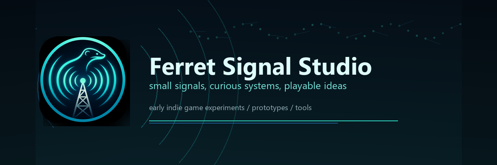

  

# Ferret Signal Studio

Ferret Signal Studio is the early home for my indie game experiments, prototypes, tools, and systems work.

It is not a big studio yet. It is more like the first signal: small, curious, a bit scrappy, and slowly turning into something real.

## What This Is

This org is where I want to collect projects that feel a little bigger than a personal repo:

- gameplay prototypes
- Unreal Engine experiments
- small tools for iteration
- AI-agent and systemic behavior tests
- future game projects under one shared name

Some things here may be polished. Some may be rough. The point is to build, learn, and keep shaping the studio identity as the work grows.

## What I Like Building

I am drawn to games and systems where small rules create interesting movement:

- readable mechanics
- clean gameplay loops
- strange little ideas that become playable
- tools that make experimentation easier
- systems that feel good once they start reacting to each other

## Current Status

Ferret Signal Studio is still in its bones phase.

Right now, it is a place for prototypes, experiments, and early foundations. Over time, it may become the label for more complete indie releases.

## Projects

Coming soon.

## Signal Notes

Small team energy. Curious systems. Build first, polish as it becomes real.

